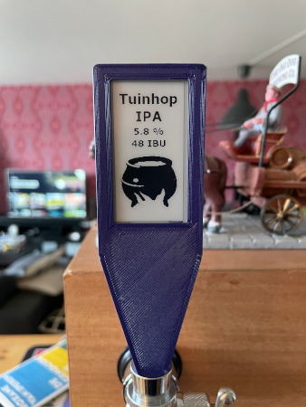

 <h1 align = "center">Beer handle e-ink taphandle</h1>

# STL
The STL for the tap-handle can be found on [Printables](https://www.printables.com/model/180667-e-ink-taphandle)

# Installation
0. Install [PlatformIO](https://docs.platformio.org/en/latest/core/installation.html)
1. Install the correct serial port driver [CP210X Driver](https://www.silabs.com/products/development-tools/software/usb-to-uart-bridge-vcp-drivers)
2. For the first use, you need to select the model you are using at the top of `main.cpp`, and select the corresponding screen header file
3. Copy `src/defConfig.h.example` to `src/defConfig.h` (and optionally change the settings)
4. Set the `upload_port` in `platformio.ini`
5. Terminal run `pio run --target uploadfs` to upload the FS file to ESP32
6. Terminal run `pio run --target upload` to upload the code to the badge

# Usage
The e-ink screen automaticly starts an webserver. Navigate to http://taphandle.local, fill in the data and click "Save". The screen automaticly update after this.

## Libraries used :
- [Fork branch/lewisxhe/GxEPD](https://github.com/lewisxhe/GxEPD)
- [Adafruit-GFX-Library](https://github.com/adafruit/Adafruit-GFX-Library)
- [AsyncTCP](https://github.com/me-no-dev/AsyncTCP)
- [ESPAsyncWebServer](https://github.com/me-no-dev/ESPAsyncWebServer)
- [AceButton](https://github.com/bxparks/AceButton)
- [ESP QRCode](https://github.com/yoprogramo/ESP_QRcode)